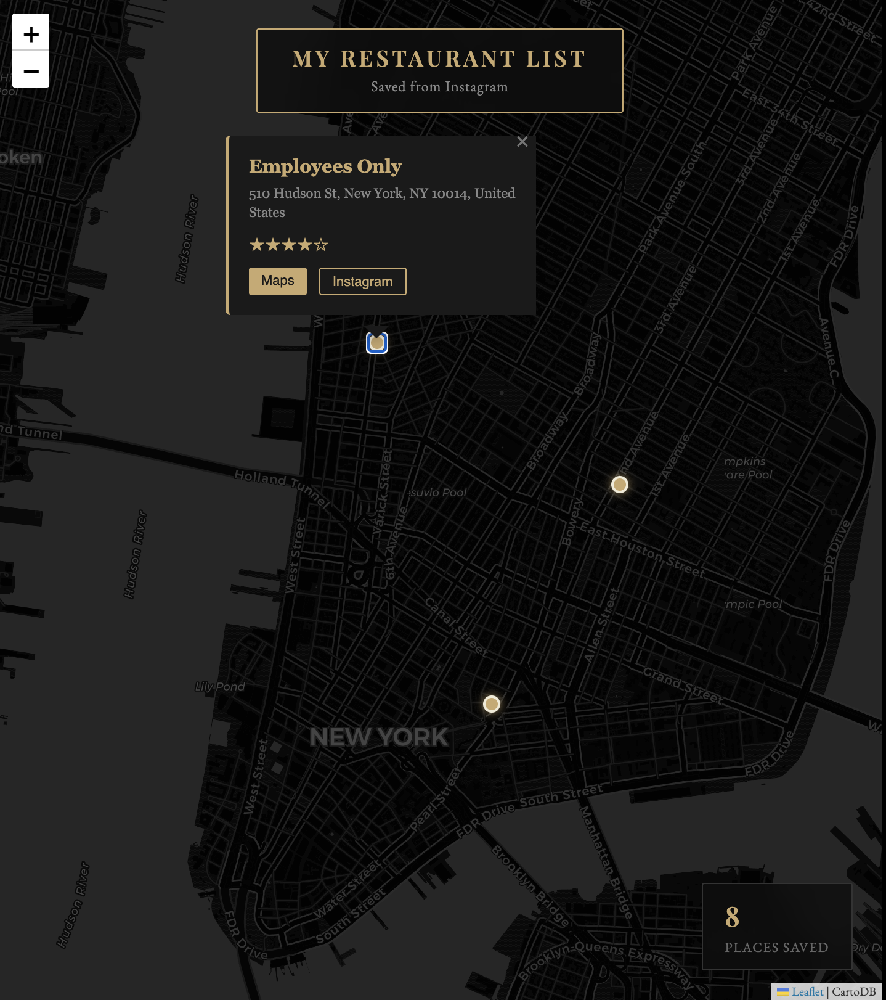

# Instagram Post Bookmarking

Moving to a new city, visiting a new place, seeing myriads of Instagram posts of places you'd like to try but don't have the patience to research and save all? Pass me the instagram post and I'll bookmark all places to a custom map!

## Overview

A Python tool that takes Instagram post URLs, extracts restaurant names and locations using AI, finds them on Google Maps, and saves them to an interactive map that the user can explore in their browser.

## How It Works

1. **Scrape** — fetches the Instagram post via Apify (no Instagram login required)
2. **Extract** — uses Groq (Llama 3) to identify restaurant names and cities from the caption and images
3. **Geocode** — looks up each restaurant on Google Maps to get coordinates, address, and rating
4. **Save** — stores results in a local SQLite database and generates a beautiful interactive map
5. **Visualize** — explore all saved spots on an interactive dark-themed map in your browser

## Demo



## Usage

**Command line** — pass one or more Instagram post URLs:
```bash
python main.py "https://www.instagram.com/p/ABC123/" "https://www.instagram.com/p/XYZ456/"
```

**Web interface** — launch the Streamlit app:
```bash
streamlit run app.py
```
Then open `http://localhost:8501` in your browser, paste your URLs, and explore your map.

## App Features

- **URL input** — paste one or more Instagram URLs and hit Extract to run the full pipeline
- **Results cards** — each found restaurant is shown with name, address, rating, and a Maps link
- **Interactive map** — all saved restaurants displayed as pins on a dark-themed map
- **Restaurant list** — browse all saved spots in a table sorted by country, city, and name, with ratings and direct Google Maps links

## Project Structure
```
├── main.py            # entry point, orchestrates the full pipeline
├── scraper.py         # fetches Instagram post data via Apify
├── extractor.py       # extracts restaurant names and cities using Groq AI
├── maps.py            # looks up places via Google Places API
├── geocoding.py       # reverse geocodes lat/lng to country
├── database.py        # saves results to SQLite
├── visualizer.py      # generates the interactive HTML map
├── export_restaurants.py  # loads restaurants into a sorted dataframe
├── app.py             # Streamlit web interface
├── requirements.txt
└── .env               # API keys (never committed)
```

## Limitations

- Only works on public Instagram posts
- Restaurant detection depends on the post having visible text or a descriptive caption
- Google Places API requires billing to be enabled (but has a free tier)

## Future Improvements

- [ ] Filter map by city or cuisine type
- [ ] Support for Reels/Video posts on Instagram
- [ ] Support for TikTok and other platforms